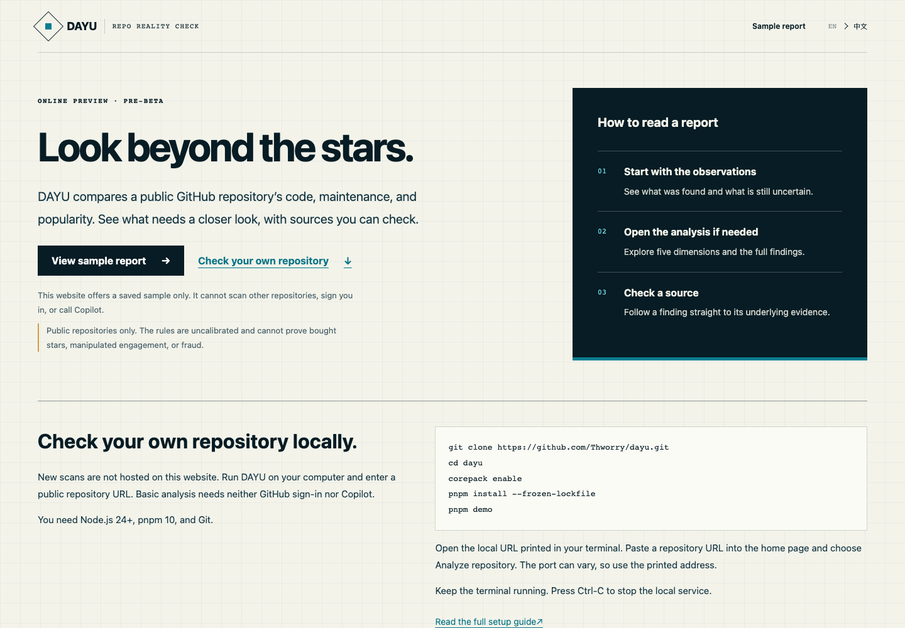
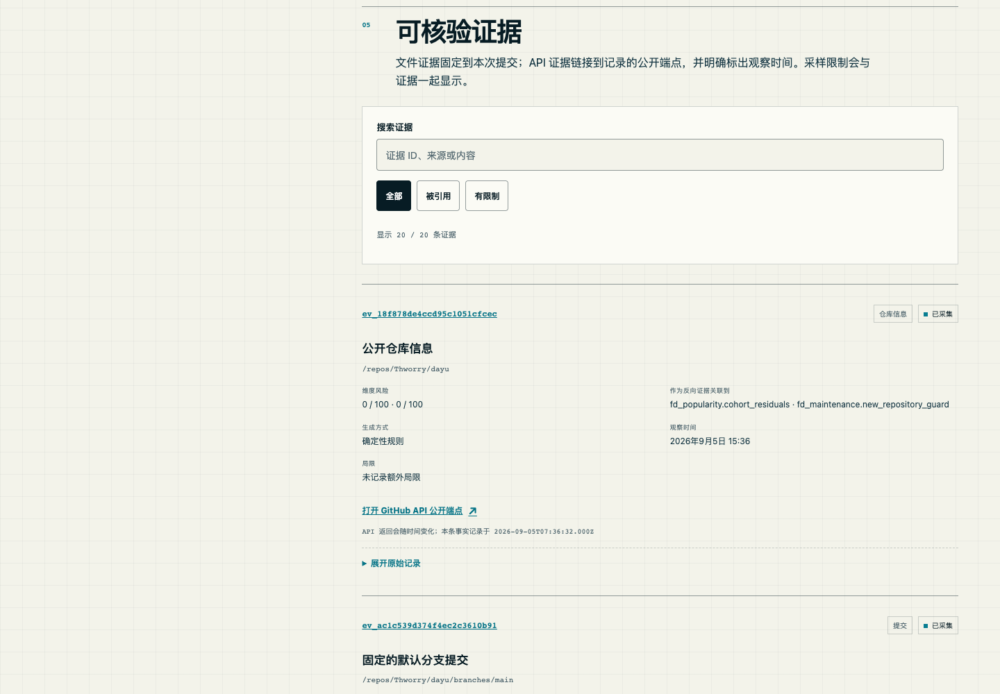

# DAYU — Repo Reality Check

[简体中文](README.zh-CN.md) · **0.x pre-beta / research preview**

DAYU (大禹治水) compares a public GitHub repository's popularity, code, maintenance, community activity, and claims. Read a short summary, then open the sources behind anything you want to check.

**Start here:** [Open the welcome page](https://thworry.github.io/dayu/?lang=en) · [Analyze your own repository locally](#quick-start)

The website lets you explore a [saved sample report](https://thworry.github.io/dayu/?lang=en&view=sample). It cannot scan other repositories, sign in, or call Copilot. To run a new analysis, follow the local setup below and paste a public repository URL into the running app.

> Pre-beta: real-world calibration and blind review are incomplete. DAYU can flag unusual or missing signals, but cannot prove bought stars, follows, or watches, infer intent, or establish fraud. The synthetic calibration examples support no accuracy claim.



The report starts with brief observations and a clear next step. Five dimensions, full findings, collection details, and evidence are available on demand. Source links open the relevant detail automatically; JSON exports always contain the complete snapshot.

## What it does

- Scans public repositories without requiring GitHub login.
- Produces a bilingual Chinese/English rules report from public GitHub data.
- Separates five dimensions: popularity 25%, substance 25%, maintenance 20%, community 15%, and claims 15%.
- Shows observed public counts, data availability, repository-type corrections, missing signals, counter-evidence, and searchable Evidence IDs. Missing values stay blank, not zero.
- Can optionally ask the signed-in user's own GitHub Copilot entitlement to review a bounded evidence packet. The base report works without Copilot.
- Exports a share-card PNG or the complete evidence JSON locally; shared links trigger a fresh scan instead of publishing a permanent AI report.

GitHub's `watchers_count` is a historical alias for stars. DAYU reads stars from `stargazers_count` and true watches from `subscribers_count`; it never presents `watchers_count` as watchers.

## Current boundaries

DAYU analyzes public repositories only. The first release deliberately excludes private repositories, global rankings, maintainer-follower authenticity scores, permanent hosted AI reports, and claims that a project “bought stars.” Scores are withheld when usable coverage is below 60%; the report becomes facts-only or “insufficient evidence” instead of inventing precision.

An uncertain repository classification also withholds scores. Evidence confidence is a heuristic of sufficiency, not a measured accuracy or coverage percentage. Five-dimensional bars show experimental risk: higher means more to check, not better quality. Copilot judgments marked “unverifiable” or “not applicable” cannot increase confidence; a review with no scorable judgments leaves the base report unchanged.

The optional enhanced result is 70% deterministic rules and up to 30% user-authorized Copilot analysis. Copilot receives selected, size-bounded evidence with untrusted repository text treated as data, has no tools, and must cite prompt-visible Evidence IDs. It is disabled unless the host configures GitHub OAuth and the user explicitly consents. DAYU does not request repository read/write, organization, email, or private-repository scopes for enhancement.

Read the full [methodology](docs/methodology.md) and [privacy model](docs/privacy.md) before interpreting a result.

## Quick start

Requirements: Node.js 24+, pnpm 10, and Git.

```bash
git clone https://github.com/Thworry/dayu.git
cd dayu
corepack enable
pnpm install --frozen-lockfile
pnpm demo
```

Open the printed loopback URL and scan a public `owner/repo`. The launcher builds the web app, starts the Fastify API and static server on `127.0.0.1`, waits for both to become ready, and stops both on Ctrl-C. No OAuth or Copilot configuration is required; the UI clearly stays in rules-only mode. Public unauthenticated GitHub rate limits can reduce a report to partial or unverifiable data.

Prefer to explore without a network scan? Choose **Explore a sample report** on the running app's home page. The local sample paths are `/en/sample` and `/zh/sample`; the hosted sample uses the separate [Pages sample URL](https://thworry.github.io/dayu/?lang=en&view=sample). The bundled [public self-check snapshot](apps/web/src/data/dayu-sample.json) contains 20 evidence records. `pnpm --filter @dayu/web build:preview` builds the API-free Pages version in `apps/web/dist-preview`.

For the complete developer checks:

```bash
pnpm exec playwright install chromium
pnpm check
pnpm e2e
pnpm --filter @dayu/calibration evaluate
```

The local command is a development/research demo, not a production deployment recipe. See [self-hosting](docs/self-hosting.md) for the required OAuth callback, encrypted token vault, trusted proxy, Redis persistence, TLS, operational limits, and shutdown behavior.

## Screenshots

The welcome screenshot shows the entry choices. Report screenshots use the same [saved sample](https://thworry.github.io/dayu/?lang=en&view=sample), captured on September 5, 2026 at 07:36 UTC from commit `9c07a83`. The overall score is withheld because real cohort calibration and blind review are incomplete. These are not screenshots of a public live scanner.

<details>
<summary>English sample report</summary>


</details>

<details>
<summary>Chinese mobile preview / 中文移动端预览</summary>


</details>

<details>
<summary>Searchable evidence / 可检索证据</summary>



</details>

## Repository map

```text
apps/api                 Fastify API, scan jobs, OAuth and Copilot orchestration
apps/web                 React bilingual scan and evidence-report experience
packages/github-collector Public GitHub evidence collection
packages/scoring-core     Deterministic rules, coverage and score composition
packages/copilot-adapter  Tool-free, evidence-citing Copilot adapter
packages/calibration      Cohorts, golden-case evaluation and release gate
packages/evidence-schema  Versioned report and Evidence ID contracts
```

## Calibration and release status

Public Beta requires at least 5,000 public repositories spread across declared type/age/star/ecosystem cohorts, 120 qualifying blind-reviewed cases with balanced ordinary/risk and per-type coverage, a false-positive claim supported by a Wilson 95% confidence interval, a manifest-bound production scoring run, no unresolved high-severity release findings, and structured minimal-permission evidence from Copilot Free, Pro, and an organization-managed account. None of those real-world checks is inferred from the sample fixtures.

```bash
pnpm --filter @dayu/calibration evaluate                 # JSON report; exits 0 for inspection
pnpm --filter @dayu/calibration evaluate --require-beta  # exits non-zero until Beta-ready
```

The manually dispatched, protected release workflow generates its evidence file during the current run after replaying every golden case through the real taxonomy and scoring packages, verifying a separate immutable reviewed-label manifest, rerunning structured security gates, and completing tool-free Copilot probes with three protected empty-scope OAuth tokens. GitHub `/user` identities must be distinct and match a protected, reviewed Free/Pro/organization account-class registry; only salted identity digests leave memory. Dependency findings and a required protected manual-review manifest are merged, every digest is recomputed, and any unresolved high or critical finding blocks release. Missing, expired, stale, or altered review data fails closed. A checked-in boolean, altered label, duplicated account, or stale SHA cannot satisfy this gate. A version tag is created only after this workflow succeeds; pushing a tag cannot bypass or start the qualification gate.

Stable v1 raises the calibration floor to 30,000 repositories and 600 double-reviewed cases. Details are in the [methodology](docs/methodology.md).

## Contributing and security

Start with [CONTRIBUTING.md](CONTRIBUTING.md) and our [Code of Conduct](CODE_OF_CONDUCT.md). Please report vulnerabilities privately as described in [SECURITY.md](SECURITY.md); never put tokens or exploit details in a public issue.

Licensed under the [Apache License 2.0](LICENSE).
