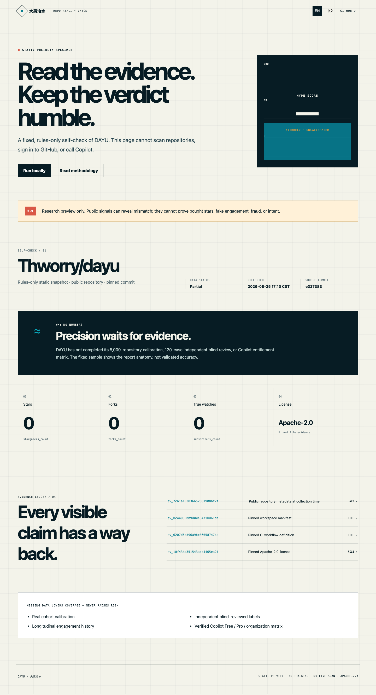
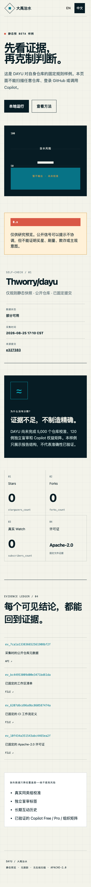

# 大禹治水 — GitHub 照妖镜

[English](README.md) · **0.x 预 Beta / 研究预览版**

大禹治水（DAYU — Repo Reality Check）是一款面向公开 GitHub 仓库的证据型体检工具。输入 `owner/repo`，它会对照人气、内容实质、维护状态、社区活动和公开说法，再把每条判断背后的证据摊开给你看。

它更像水位仪，不是法槌。DAYU 能提示比例反常、信号缺失和“宣传与仓库现状对不上”等情况，但**不能证明 star、follow 或 watch 是买来的**，不能推断动机，也不会给项目或维护者扣上“造假”的帽子。

> 发布状态：当前是 0.x 预 Beta 研究预览版，尚未达到公开 Beta 的校准门槛。仓库里的校准数据只是小规模合成示例，不能用于宣传准确率。运行 `pnpm --filter @dayu/calibration evaluate` 可查看机器可读的真实状态。

[打开静态预览](https://thworry.github.io/dayu/?lang=zh) · [在本地运行仅规则版](#本地开始)

线上预览只是 DAYU 对自身仓库的固定快照：不能扫描任意仓库、不能登录 GitHub，也不会调用 Copilot。交互式扫描器只提供本地运行路径，让用户可以直接验证公开数据行为与限制，同时避免把尚未校准的服务包装成正式产品。



> 截图说明：这是固定在 `e327383` 提交上的 DAYU 自身公开仓库“仅规则、未经校准”快照，只用于展示报告结构，不代表准确率已经验证，也不能证明任何操纵行为。

## 能做什么

- 不登录 GitHub 也能扫描公开仓库，得到基础规则报告。
- 中英文报告共享同一组数值与证据，但文案分别按两种语言自然表达。
- 五个维度分别为：人气 25%、内容实质 25%、维护状态 20%、社区 15%、公开说法 15%。
- 清楚展示数据覆盖率、仓库类型校正、缺失项、反向证据和稳定的 Evidence ID。
- 用户可自愿登录并调用自己的 GitHub Copilot 权益，对有限的证据包做补充分析；没有 Copilot 也不影响基础报告。
- 分享卡片在本地生成 PNG；分享链接会重新扫描，不会把 AI 报告永久公开托管。

GitHub 的 `watchers_count` 实际是 star 的历史别名。DAYU 使用 `stargazers_count` 读取 star，使用 `subscribers_count` 读取真正的 watch，绝不会把 `watchers_count` 当作关注人数。

## 明确边界

DAYU 只分析公开仓库。v1 明确不做私有仓库、全站排行榜、维护者粉丝真实性评分、永久公开的 AI 报告，也不会下“买星”结论。可用数据覆盖低于 60% 时不输出看似精确的分数，而是退化成事实清单或“证据不足”。

可选增强结果由 70% 的确定性规则和最多 30% 的用户授权 Copilot 分析组成。Copilot 只接收经过筛选、限长的证据；仓库文本始终按不可信数据处理；会话没有工具权限；结论必须引用本次提示中真实可见的 Evidence ID。只有部署者配好 GitHub OAuth、且用户明确同意后，增强入口才可用。DAYU 不会为增强分析申请仓库读写、组织、邮箱或私有仓库权限。

解读结果前，请先阅读[评分方法](docs/methodology.md)和[隐私说明](docs/privacy.md)。

## 本地开始

需要 Node.js 24+、pnpm 10 和 Git。

```bash
corepack enable
pnpm install --frozen-lockfile
pnpm demo
```

打开命令行打印的本机地址，然后输入公开的 `owner/repo`。启动器会构建前端，在 `127.0.0.1` 上启动 Fastify API 和静态服务器，等待两端就绪，并在按下 Ctrl-C 时一起关闭。无需配置 OAuth 或 Copilot，界面会清楚保持“仅规则”模式。GitHub 未登录公共 API 的限流可能让报告退化为部分数据或“无法验证”。

如需执行完整开发检查：

```bash
pnpm exec playwright install chromium
pnpm check
pnpm e2e
pnpm --filter @dayu/calibration evaluate
```

这条本地命令是开发／研究演示入口，不是生产部署配方。生产环境仍需 OAuth 回调、加密令牌保险库、可信代理、Redis 持久化、TLS、运行限额和优雅停机，详见[自托管指南](docs/self-hosting.md)。

## 截图

已提交的截图来自同一份[静态预览](https://thworry.github.io/dayu/?lang=zh)和固定自检 JSON。因为真实同类组校准与独立盲审尚未完成，预览特意不输出综合数字；它也不是公开在线扫描器的截图。

<details>
<summary>中文移动端预览</summary>



</details>

## 校准与发布门槛

公开 Beta 至少需要 5,000 个按类型、年龄、star 量级和生态分层的公开仓库，120 个普通/风险及各仓库类型分布合格的盲审案例，由 Wilson 95% 置信区间支持的误报率结论，与清单摘要绑定的生产评分运行，没有未解决的高危发布问题，并分别提供 Copilot Free、Pro 和组织托管账号的最小权限实测证据。示例数据不会冒充这些真实验证。

```bash
pnpm --filter @dayu/calibration evaluate                 # 输出 JSON，便于查看当前状态
pnpm --filter @dayu/calibration evaluate --require-beta  # 未达 Beta 门槛时返回非零状态
```

受保护的发布工作流只能手动触发，并会在本次运行中生成证据文件：每个黄金案例都要经过真实 taxonomy 与评分包重放，预期分类、挑战标签、盲审状态、审阅人数与审阅来源还会通过独立的人工标签清单重新验签。三枚受保护的空 scope OAuth 令牌完成无工具 Copilot 探测时，工作流会从 GitHub `/user` 核对身份，确保三个账号互不相同，并与受保护环境里经审阅的 Free／Pro／组织账号分类清单逐一匹配；离开内存的只有加盐身份摘要。依赖审计 findings 还会与受保护环境中必需的人工安全审查清单合并，所有摘要都要在本次运行中重算。人工清单缺失、过期、commit 不符或被篡改，以及任何未解决的 high／critical 问题，都会阻断发布；已解决项仍保留在机器可读证据中。仓库中预写的布尔值、被改动的人工标签、重复账号或旧 SHA 都无法通过门槛。版本标签只能在工作流成功后创建；推送标签不能绕过或启动资格门禁。

稳定版 v1 的门槛提高到 30,000 个仓库和 600 个双人复核案例，详见[评分方法](docs/methodology.md)。

## 参与贡献与安全报告

请从 [CONTRIBUTING.md](CONTRIBUTING.md) 和[行为准则](CODE_OF_CONDUCT.md)开始。发现漏洞请按照 [SECURITY.md](SECURITY.md) 私下报告，不要在公开 issue 中粘贴令牌或利用细节。

项目使用 [Apache License 2.0](LICENSE)。
